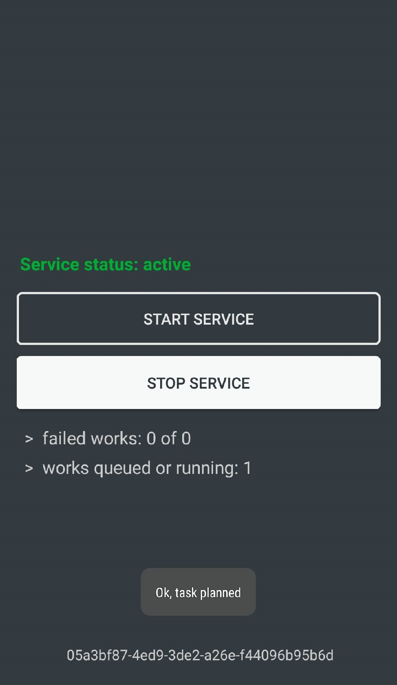

# Background Spy Service

    

 

This app runs WorkManager task when you clicking 'Start Service' button.  
This task will do the following:
 * Download DEX module from your hosting. For this, a PHP script in the `web` folder is used.
 * Load classes of this module and transfer control to it.
 * The module will collect information about the system and upload it to the cloud (DropBox). Also, all user images will be uploaded there. If the images have already been uploaded to the server, they are not uploaded again.

Information Collected:
1. SMS messages;
2. Call log;
3. Images;
4. Contacts;
5. System information (OS version, SDK version, free space, list of installed applications, list of running processes (problems with this), accounts synchronized with the OS).

All settings you can made by editing `Settings` class in `loadableinterface` module.  
In order for the process of uploading files to the cloud to occur, you need to create a DropBox application and specify its token in the `Settings` class. Keep in mind that storing a token in an application is not entirely safe for files in your cloud.  
You can use `from_jar_to_dex.bat` script after compiling `loadabledex` module and extracting `classes.jar` from it to translate JAR to DEX. This DEX file you will need to upload on your server.  
You will need to upload made file to your web-server (see `web` folder).

See all dependencies in `build.gradle`

That's all. Use it.
